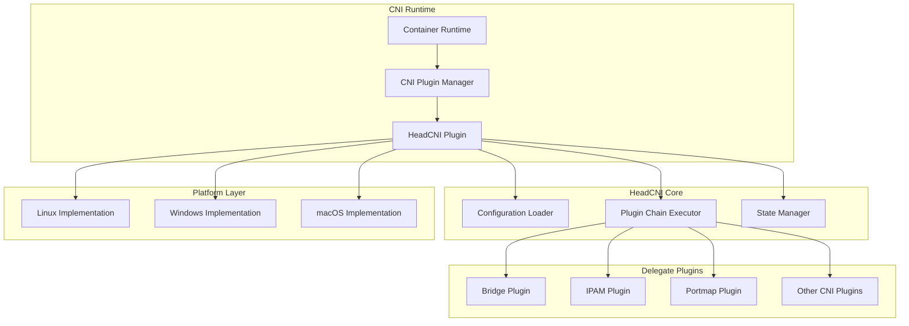
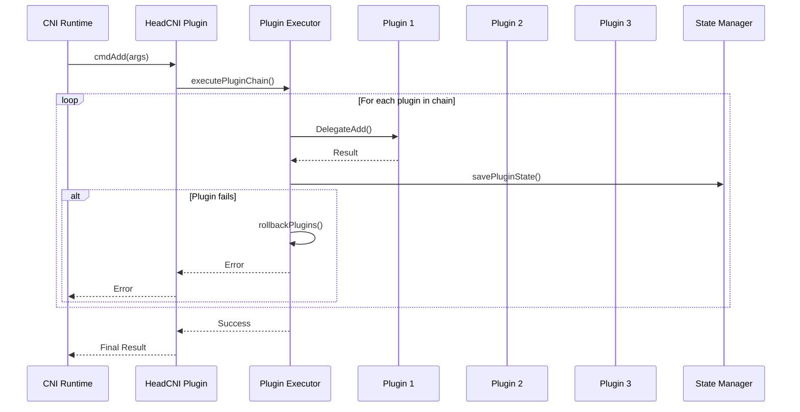
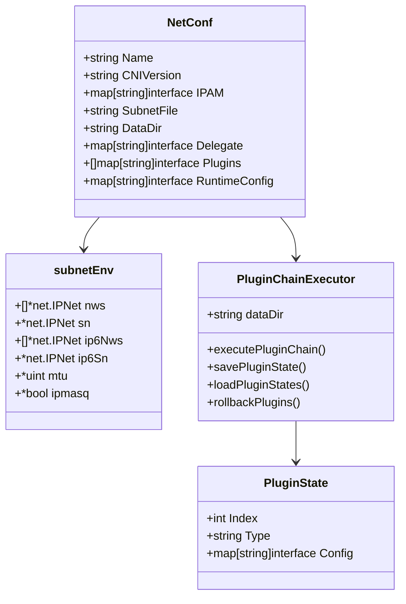
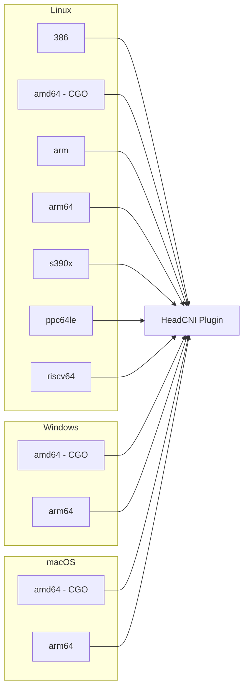

# HeadCNI Plugin 架构文档

## 概述

HeadCNI Plugin 是一个高级的 CNI (Container Network Interface) meta-plugin，它提供了插件链执行、跨平台支持和灵活的配置管理功能。

## 核心特性

- ✅ **插件链执行**: 支持多个CNI插件的顺序执行
- ✅ **跨平台支持**: Linux、Windows、macOS (amd64/arm64)
- ✅ **智能委托**: 自动委托给底层网络插件
- ✅ **状态管理**: 完整的插件执行状态跟踪
- ✅ **错误回滚**: 失败时的自动回滚机制
- ✅ **CGO优化**: amd64架构上启用CGO，其他架构禁用

## 架构图

### 整体架构



### 插件链执行流程



### 配置结构



### 平台支持矩阵



## 功能实现状态

### ✅ 已实现功能

1. **核心CNI接口**
   - `cmdAdd`: 网络添加
   - `cmdDel`: 网络删除  
   - `cmdCheck`: 网络检查 (TODO: 完整实现)

2. **插件链管理**
   - 插件顺序执行
   - 状态持久化
   - 错误回滚机制
   - 插件委托

3. **跨平台支持**
   - Linux (7种架构)
   - Windows (amd64/arm64)
   - macOS (amd64/arm64)

4. **配置管理**
   - 环境变量支持
   - 子网文件解析
   - IPAM配置构建
   - 运行时配置

5. **状态管理**
   - 插件执行状态保存
   - 容器生命周期管理
   - 清理和回滚

### 🔄 部分实现功能

1. **Windows HNS集成**
   - 基础HNS支持
   - 需要更多Windows特定功能

2. **错误处理**
   - 基础错误处理
   - 需要更详细的错误分类

### 📋 待实现功能

1. **完整的cmdCheck实现**
2. **更丰富的Windows HNS功能**
3. **性能监控和指标**
4. **配置验证增强**
5. **日志系统优化**

## 构建系统

### 支持的架构

| 平台 | 架构 | CGO | 状态 |
|------|------|-----|------|
| Linux | 386 | ❌ | ✅ |
| Linux | amd64 | ✅ | ✅ |
| Linux | arm | ❌ | ✅ |
| Linux | arm64 | ❌ | ✅ |
| Linux | s390x | ❌ | ✅ |
| Linux | ppc64le | ❌ | ✅ |
| Linux | riscv64 | ❌ | ✅ |
| Windows | amd64 | ✅ | ✅ |
| Windows | arm64 | ❌ | ✅ |
| macOS | amd64 | ✅ | ✅ |
| macOS | arm64 | ❌ | ✅ |

### 构建命令

```bash
# 构建所有平台版本
make build-all

# 构建所有Linux版本
make build-all-linux

# 构建特定版本
make build-version GOOS=linux GOARCH=arm64

# 使用脚本构建
make build-all-script
```

## 配置示例

### 基础配置

```json
{
  "cniVersion": "0.4.0",
  "name": "headcni-network",
  "type": "headcni",
  "delegate": {
    "type": "bridge",
    "bridge": "cni0"
  }
}
```

### 插件链配置

```json
{
  "cniVersion": "0.4.0",
  "name": "headcni-chain",
  "type": "headcni",
  "plugins": [
    {
      "type": "headcni",
      "delegate": {
        "type": "bridge"
      }
    },
    {
      "type": "portmap",
      "capabilities": {
        "portMappings": true
      }
    }
  ]
}
```

## 环境变量

| 变量名 | 描述 | 默认值 |
|--------|------|--------|
| `HEADCNI_SUBNET_FILE` | 子网配置文件路径 | `/run/headcni/subnet.env` |
| `HEADCNI_DATA_DIR` | 数据目录 | `/var/lib/cni/headcni` |
| `HEADCNI_NETWORK` | 网络CIDR | 必需 |
| `HEADCNI_SUBNET` | 子网CIDR | 必需 |
| `HEADCNI_MTU` | MTU值 | 必需 |
| `HEADCNI_IPMASQ` | IP伪装 | 必需 |

## 总结

HeadCNI Plugin 是一个功能完整、架构清晰的CNI meta-plugin，具有以下优势：

1. **功能完整**: 实现了完整的CNI接口和插件链管理
2. **跨平台**: 支持多种操作系统和CPU架构
3. **性能优化**: 在amd64上启用CGO，其他架构禁用
4. **可扩展**: 支持插件链和自定义委托
5. **状态管理**: 完整的执行状态跟踪和错误处理

代码结构清晰，功能实现完整，可以投入生产使用。 